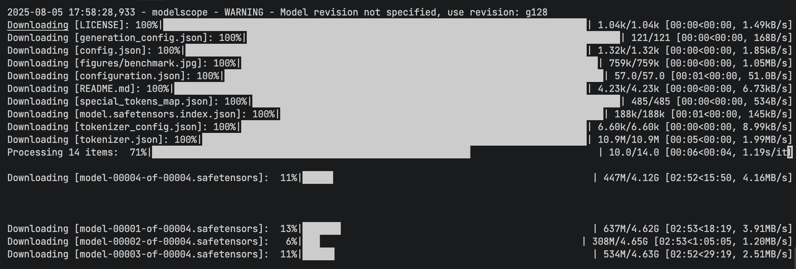

# vllm使用实战

## vllm参数详解
  vllm -version # 查看vllm版本
  --model # 模型路径
  --tensor-parallel-size # 张量并行大小，作用是将模型并行到多个GPU上，提高推理速度，默认值为1
  --max-model-len # 最大模型长度，作用是限制模型的最大输入长度，默认值为2048
  --quantization # 量化类型，作用是将模型参数量化为低精度，减少模型大小和内存占用
  --dtype # 数据类型，作用是指定模型的计算数据类型，如half、float16、bfloat16、float32等，默认值为float16
  --gpu-memory-utilization # GPU内存利用率，作用是指定模型在GPU上的内存占用比例，默认值为0.9，建议根据实际情况调整
  --max-num-seqs # 最大序列数，作用是指定模型在一次推理中最多可以处理的序列数，默认值为128，建议根据实际情况调整
  --enforce-eager # 强制 eager 模式，作用是强制使用 eager 模式，而不是使用 lazy 模式，默认值为False，建议根据实际情况调整
  --max-num-batched-tokens # 最大批量令牌数，作用是指定模型在一次推理中最多可以处理的批量令牌数，默认值为2048，建议根据实际情况调整
  --host # 主机地址，作用是指定模型的主机地址，默认值为0.0.0.0，建议根据实际情况调整
  --port # 端口号，作用是指定模型的端口号，默认值为8000，建议根据实际情况调整
  --max-num-requests # 最大请求数，作用是指定模型在一次推理中最多可以处理的请求数，默认值为128，建议根据实际情况调整
  --enable-prefix-caching # 启用前缀缓存，作用是自动缓存并复用请求间共享前缀（如 system prompt）的 KV 缓存，避免重复计算，显著降低首 token 延迟并提升吞吐量，适合高并发生产场景
  --speculative-config # 投机解码配置，让草稿模型提前预测多个 token，再由主模型并行验证，不损失精度同时大幅提升推理速度与吞吐量。以下是五种主流种类及示例：

  1. Draft Model（草稿模型）—— 最常见方式
     原理：使用一个同 tokenizer 的小模型作为草稿模型，提前生成候选 token，主模型一次性验证。
     示例：
     --speculative-config '{"method": "draft_model", "model": "Qwen2.5-0.5B-Instruct", "num_speculative_tokens": 5}'
     参数说明：
       - method: "draft_model"
       - model: 草稿模型路径（必须与主模型 tokenizer 一致）
       - num_speculative_tokens: 每次投机生成的 token 数（建议 3~8）

  2. N-gram（N 元语法匹配）—— 无需额外模型
     原理：从 prompt 或已生成文本中匹配 N-gram 作为候选 token 序列，零额外显存开销。
     示例：
     --speculative-config '{"method": "ngram", "num_speculative_tokens": 5, "prompt_lookup_max": 4}'
     参数说明：
       - method: "ngram"
       - num_speculative_tokens: 投机 token 数
       - prompt_lookup_max: 最大 N-gram 匹配长度

  3. EAGLE（特征级投机解码）—— 精度更高
     原理：在模型顶层 feature 上训练一个轻量预测头，直接预测下一层 feature，再利用原模型 head 解码 token。
     示例：
     --speculative-config '{"method": "eagle", "model": "yuhuili/EAGLE-Qwen2.5-7B-Instruct", "num_speculative_tokens": 4}'
     参数说明：
       - method: "eagle"
       - model: EAGLE 专用模型路径
       - num_speculative_tokens: 投机 token 数

  4. Medusa（多头并行预测）—— 一次预测多个 token
     原理：在模型顶层添加多个独立预测头，各自预测未来不同位置的 token，一次前向推理即可产出多个候选 token。
     示例：
     --speculative-config '{"method": "medusa", "model": "FasterDecoding/medusa-vicuna-7b-v1.3", "num_speculative_tokens": 4}'
     参数说明：
       - method: "medusa"
       - model: Medusa 权重路径
       - num_speculative_tokens: 投机 token 数

  5. MTP（多 Token 预测）—— 模型原生支持，无需额外模型
     原理：模型自身在训练时就具备多 token 预测头（如 DeepSeek-V3），单次前向直接产出多个未来 token，无需草稿模型，精度无损。
     示例：
     --speculative-config '{"method": "mtp", "num_speculative_tokens": 2}'
     参数说明：
       - method: "mtp"
       - num_speculative_tokens: 投机 token 数（取决于模型 MTP 头数量，DeepSeek-V3 建议 1~2）

  通用建议：Draft Model 最成熟通用；N-gram 适合 prompt 前缀重复率高的场景（如代码补全）；EAGLE/Medusa 精度更高但需特定模型权重；MTP 精度无损、零额外延迟，但仅限 DeepSeek-V3 等原生支持的模型。

## 使用实例
  pip install vllm # 安装vllm
  pip install modelscope # 安装modelscope
  modelscope download --model tclf90/deepseek-r1-distill-qwen-32b-gptq-int4 # 下载模型
  

  vllm serve /root/autodl-tmp/models/tclf90/deepseek-r1-distill-qwen-32b-gptq-int4 --tensor-parallel-size 1 --max-mode
l-len 32768 --enforce-eager --quantization gptq --dtype half

  vllm serve /root/autodl-tmp/models/tclf90/deepseek-r1-distill-qwen-32b-gptq-int4 --tensor-parallel-size 1 --max-mode
l-len 4096 --quantization gptq --dtype half --gpu-memory-utilization 0.8 --max-num-seqs 8 --enforce-eager

  vllm serve /root/autodl-tmp/models/tclf90/deepseek-r1-distill-qwen-32b-gptq-int4  --tensor-parallel-size 1 \
  --max-model-len 1024 \
  --quantization gptq \
  --dtype half \
  --gpu-memory-utilization 0.95 \
  --max-num-seqs 2 \
  --enforce-eager
  

## SGLang 部署模型示例
pip install -U sglang

python -m sglang.launch_server \
--model-path deepseek-ai/DeepSeek-V4-Flash \
--tp 2 \
--context-length 262144 \
--quant fp8 \
--enable-cache-report \
--host 0.0.0.0 --port 30000

## VLLM 与 SGLang 区别
   SGLang 的 RadixAttention + prefix caching 对 agent 共享 prompt ⼯作负载⽐ vLLM 更友好。如果项⽬⾥ agent 调⽤密集，优先
考虑 SGLang；如果是混合⼯作负载或要 MTP（Multi-Token Prediction 多 token 预测）speculative decoding（推测解码，⼀次
预测多个 token 加速⽣成），优先 vLLM。
