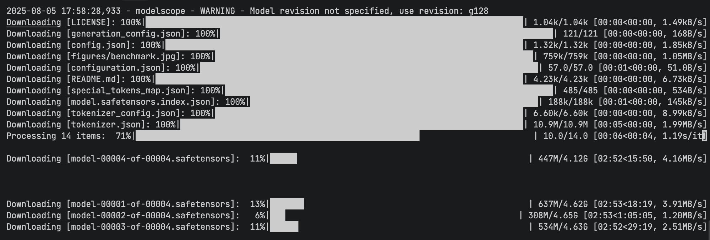

# vllm使用实战

## vllm参数详解
  vllm -version # 查看vllm版本
  --model # 模型路径
  --tensor-parallel-size # 张量并行大小，作用是将模型并行到多个GPU上，提高推理速度，默认值为1
  --max-model-len # 最大模型长度，作用是限制模型的最大输入长度，默认值为2048
  --quantization # 量化类型，作用是将模型参数量化为低精度，减少模型大小和内存占用
  --dtype # 数据类型，作用是指定模型的计算数据类型，如half、float16、bfloat16、float32等，默认值为float16
  --gpu-memory-utilization # GPU内存利用率，作用是指定模型在GPU上的内存占用比例，默认值为0.9，建议根据实际情况调整
  --max-num-seqs # 最大序列数，作用是指定模型在一次推理中最多可以处理的序列数，默认值为128，建议根据实际情况调整
  --enforce-eager # 强制 eager 模式，作用是强制使用 eager 模式，而不是使用 lazy 模式，默认值为False，建议根据实际情况调整
  --max-num-batched-tokens # 最大批量令牌数，作用是指定模型在一次推理中最多可以处理的批量令牌数，默认值为2048，建议根据实际情况调整

## 使用实例
  pip install vllm # 安装vllm
  pip install modelscope # 安装modelscope
  modelscope download --model tclf90/deepseek-r1-distill-qwen-32b-gptq-int4 # 下载模型
  

  vllm serve /root/autodl-tmp/models/tclf90/deepseek-r1-distill-qwen-32b-gptq-int4 --tensor-parallel-size 1 --max-mode
l-len 32768 --enforce-eager --quantization gptq --dtype half

  vllm serve /root/autodl-tmp/models/tclf90/deepseek-r1-distill-qwen-32b-gptq-int4 --tensor-parallel-size 1 --max-mode
l-len 4096 --quantization gptq --dtype half --gpu-memory-utilization 0.8 --max-num-seqs 8 --enforce-eager

  vllm serve /root/autodl-tmp/models/tclf90/deepseek-r1-distill-qwen-32b-gptq-int4  --tensor-parallel-size 1 \
  --max-model-len 1024 \
  --quantization gptq \
  --dtype half \
  --gpu-memory-utilization 0.95 \
  --max-num-seqs 2 \
  --enforce-eager